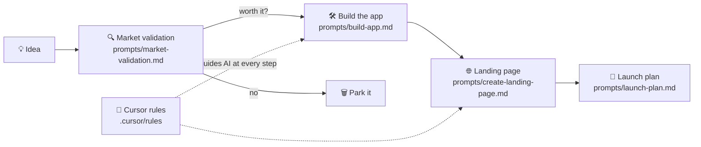

<div align="center">

# 🧫 Stan & Scoot Labs

**An AI-assisted playbook for taking app ideas from concept to launch.**


</div>

---

## 💡 What it is

A shared studio workspace with a repeatable process, prompt templates and Cursor rules, so each new app idea follows the same path: **validate → build → land → launch**.

> 🚧 **Status:** The structure is in place, and the playbook content is being written.

## 🔄 The workflow



## 📂 Structure

```
00_START_HERE/
  HOW_THIS_WORKS.md        How the studio process works
  PROJECT_WORKFLOW.md      Step-by-step project lifecycle
  AI_PROMPT_TEMPLATES.md   Reusable prompt patterns
  CURSOR_RULES.md          How the AI coding rules are used
prompts/
  market-validation.md     Research demand & competition
  build-app.md             Build the MVP with AI
  create-landing-page.md   Generate the marketing page
  launch-plan.md           Go-to-market checklist
.cursor/rules/
  project-rules.mdc        Shared rules for Cursor
```

## 🔗 Related

- [App Validation System](https://github.com/scootero/App-Validation-System): the automated version of the validation step (n8n, Vercel and Meta ads)

---

<div align="center">

Built by **[Scott Oliver](https://github.com/scootero)**

</div>
